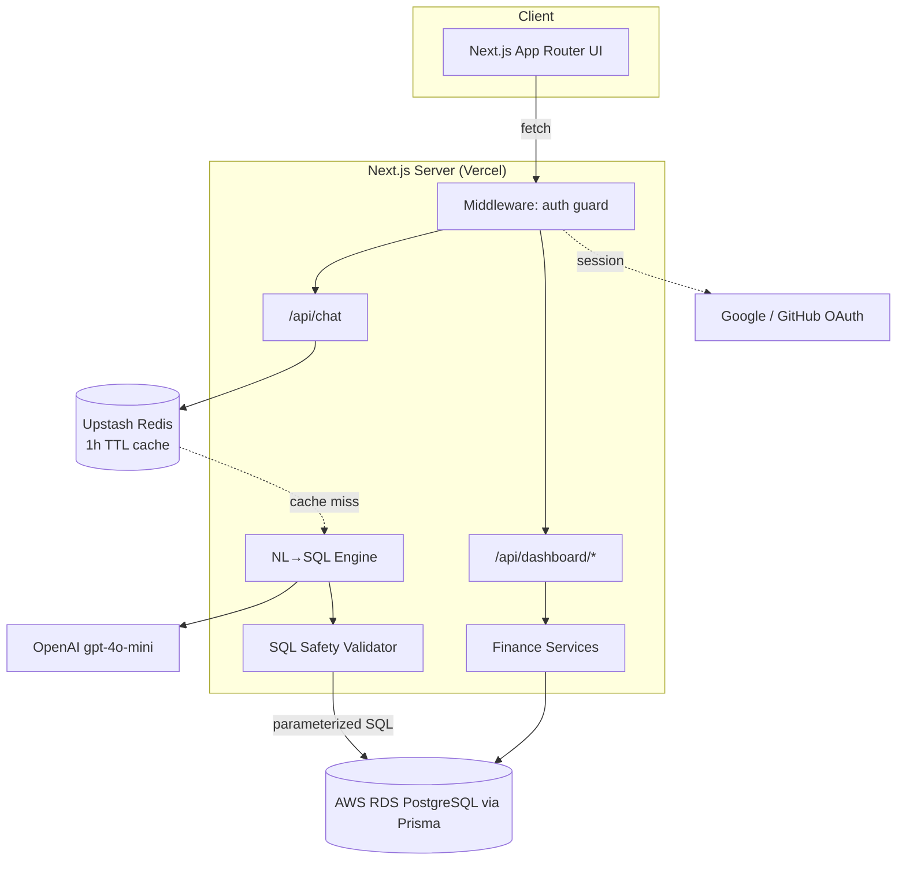

# CashChat

AI-powered personal finance dashboard with natural-language analytics. Ask
questions like *"How much did I spend on food in May?"* and get back a real
answer computed from your own transaction data — not a hallucinated guess.

```
"How much did I spend on food in May?"
        │
        ▼
  OpenAI (gpt-4o-mini) → { sql, explanation, chartType }
        │
        ▼
  SQL Safety Layer (validateSql) ── rejects anything that isn't a single,
        │                           tenant-scoped SELECT/WITH
        ▼
  Postgres (parameterized execution, userId bound — never concatenated)
        │
        ▼
  Chart-data shaping → Redis cache (1h TTL) → JSON response → Chat UI
```

## Architecture



## Tech stack

Next.js 14 (App Router) · TypeScript · Tailwind CSS · Recharts · TanStack
Query · Zustand · NextAuth.js (Google + GitHub, JWT sessions) · Prisma ORM ·
PostgreSQL (AWS RDS in prod) · OpenAI gpt-4o-mini · Upstash Redis · Docker ·
GitHub Actions.

## Security model — read this before deploying

The chat assistant lets an LLM generate SQL that runs against a real
database. That's the riskiest part of this app, so it's defended in layers:

1. **Schema-aware, security-ruled prompt** (`src/lib/openai/prompt.ts`,
   `schemaContext.ts`) — the model is only told about `accounts` and
   `transactions`, and is instructed to always scope queries to the current
   user via a `:currentUserId` placeholder, never to write DML/DDL, and to
   treat the user's question as untrusted input (prompt-injection guard).
2. **`validateSql()`** (`src/lib/validators/sql.ts`) — every generated query
   is parsed and rejected unless it: is a single statement; has no
   comments; starts with `SELECT`/`WITH`; contains no DML/DDL/admin
   keywords; only references whitelisted tables/columns; and includes the
   tenant-scoping placeholder exactly once. See
   `src/lib/validators/__tests__/sql.test.ts` for the adversarial cases this
   is tested against (stacked statements, comment-smuggled DROPs, etc.).
3. **Parameter binding, not string concatenation** — the placeholder is
   swapped for Postgres's `$1` and the *actual* userId is passed as a bound
   parameter to `prisma.$queryRawUnsafe`. The model never sees or controls
   the real user id.
4. **Defense in depth (recommended for production)**: point `DATABASE_URL`
   at a Postgres role that only has `GRANT SELECT` on `accounts` and
   `transactions` — so even a theoretical bypass of layers 1–3 can't write
   or read other tables. This repo doesn't provision that role for you (it
   depends on your hosting setup); see the migration/RDS notes below.

No layer here is sufcient alone — they're intentionally redundant.

## What's fully implemented vs. what's a starting point

**Fully implemented and tested:** Prisma schema + seed script, the SQL
safety validator (with a passing test suite), the NL→SQL prompt and
pipeline, all dashboard/chat API routes, the dashboard and chat UI, Redis
caching, NextAuth wiring, Docker/Compose, and the GitHub Actions CI
pipeline. All of this was type-checked, linted, and run through a
production `next build` while building this repo.

**Worth strengthening before a real launch:**
- *Streaming*: the chat UI shows staged loading states (thinking →
  querying) rather than token-level streaming, because there's nothing
  meaningful to stream until SQL has been generated *and* executed. True
  token streaming of the `explanation` field is a small follow-up (switch
  the OpenAI call to `stream: true`, forward deltas over SSE).
- *Rate limiting* on `/api/chat` (e.g. Upstash's `@upstash/ratelimit`) isn't
  wired in yet — worth adding before exposing this publicly, since each
  uncached question costs an OpenAI call.
- *Migration history*: `prisma/schema.prisma` is final, but no
  `prisma/migrations/` folder is checked in yet — run
  `npx prisma migrate dev --name init` once against a real database and
  commit the result (CI currently uses `prisma db push` for simplicity).
- *Read-only DB role* described above isn't provisioned by this repo.

## Project structure

```
src/
  app/                 # Next.js App Router pages + API routes
    dashboard/         # /dashboard (summary cards, charts, tables)
    chat/              # /chat (NL chat assistant)
    api/
      auth/[...nextauth]/
      chat/            # POST /api/chat
      dashboard/       # GET summary | categories | trends | merchants | transactions
  components/
    dashboard/         # SummaryCards, RecentTransactionsTable
    charts/            # CategoryPieChart, MonthlyTrendChart, TopMerchantsTable
    chat/              # ChatWindow, ChatMessage, ChatInput, ResultRenderer
    layout/            # Sidebar, Navbar
    ui/                # shadcn-style primitives (button, card, table)
  lib/
    prisma.ts          # Prisma singleton
    redis.ts           # Upstash cache helpers
    auth.ts            # NextAuth config
    session.ts         # requireUserId() for route handlers
    openai/            # client, schema context, prompt, NL->SQL orchestration
    validators/        # zod schemas + the SQL safety validator (+ tests)
  services/
    finance/           # summary, categories, trends, merchants, transactions
    chat/              # chatService: cache -> NL->SQL -> execute -> shape
  hooks/, store/, types/
prisma/
  schema.prisma
  seed.ts
.github/workflows/ci.yml
Dockerfile, docker-compose.yml
```

## Getting started

```bash
npm install
cp .env.example .env   # fill in real values (see below)

# local Postgres + Redis via Docker
docker compose up -d db redis

npx prisma migrate dev --name init   # creates migration history + applies schema
npm run db:seed                       # seeds a demo user + 500+ transactions

npm run dev
```

Visit `http://localhost:3000`, sign in with Google or GitHub, and you'll
land on `/dashboard` for the demo user's seeded data. (NextAuth creates a
new `User` row per OAuth login — to see the seeded demo data in your own
session, either update the seeded `User.email` to match your OAuth email,
or query as the seeded user directly via Prisma Studio: `npm run
prisma:studio`.)

### Required environment variables

See `.env.example` for the full list and where to obtain each value:
`DATABASE_URL`, `NEXTAUTH_SECRET`, `NEXTAUTH_URL`, `GOOGLE_CLIENT_ID/SECRET`,
`GITHUB_CLIENT_ID/SECRET`, `OPENAI_API_KEY`, `UPSTASH_REDIS_REST_URL/TOKEN`.

### Tests

```bash
npm run test         # vitest — currently covers the SQL safety validator
npm run type-check
npm run lint
```

## Deployment

**App (Vercel):**
1. Push this repo to GitHub.
2. Import it in Vercel, set the environment variables from `.env.example`.
3. Vercel runs `npm run build` (which runs `prisma generate` via
   `postinstall`) automatically on every push to `main`.

**Database (AWS RDS PostgreSQL):**
1. Create a PostgreSQL 16 RDS instance (private subnet + security group
   allowing inbound 5432 from Vercel's IPs or via a connection pooler like
   RDS Proxy / PgBouncer — Vercel functions are short-lived, so connection
   pooling matters at scale).
2. Set `DATABASE_URL` to the RDS endpoint, then run
   `npx prisma migrate deploy` from CI/CD (the GitHub Actions workflow in
   this repo runs `prisma db push` for PR validation against an ephemeral
   CI Postgres; wire a separate deploy step to run `migrate deploy` against
   RDS on merge to `main`).
3. Optionally provision a read-only `app_readonly` role and have the
   app connect with it, per the Security Model section above.

**Cache (Upstash Redis):** create a free-tier Redis database at
console.upstash.com, copy the REST URL + token into `.env`.

**Docker (self-hosting / local parity with prod):**
```bash
docker compose up --build
```
This builds the multi-stage `Dockerfile` (Next.js standalone output) and
runs it alongside local Postgres + Redis containers. In production, swap
the `app` service's `DATABASE_URL` to RDS and drop the local `db`/`redis`
services entirely (Upstash is HTTP-based and needs no container).

## CI

`.github/workflows/ci.yml` runs on every push/PR to `main`: install →
`prisma generate` → type-check → lint → unit tests → schema sync against an
ephemeral Postgres service container → production build.
